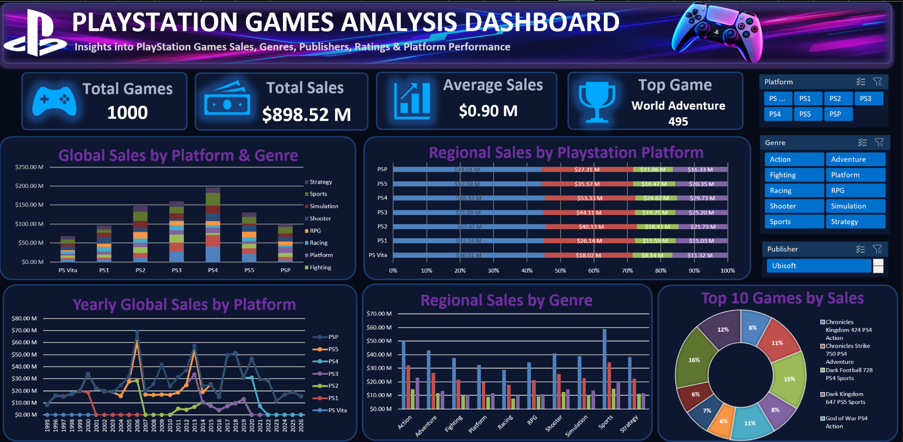

# 🎮 PlayStation Sales Dashboard

An interactive **PlayStation Games Sales Dashboard** developed using Microsoft Excel to analyze game sales, platforms, genres, critic ratings, release trends, and regional performance.

The project transforms raw PlayStation game data into an interactive dashboard using **PivotTables, Pivot Charts, Excel formulas, and data visualization techniques**.

---

## 📊 Dashboard Preview



---

## 🎯 Project Objective

The main objective of this project is to analyze PlayStation game sales data and build an interactive dashboard that provides insights into:

- Game sales performance
- Top-selling games
- Platform-wise sales
- Genre-wise performance
- Regional sales distribution
- Game release trends
- Relationship between critic ratings and sales

The dashboard allows users to interact with the data using filters and slicers.

---

## 🛠️ Tools & Technologies

- **Microsoft Excel**
- **PivotTables**
- **Pivot Charts**
- **Excel Formulas**
- **Slicers**
- **Data Cleaning**
- **Data Transformation**
- **Data Visualization**

---

## 📌 Key Performance Indicators

The dashboard includes the following KPIs:

| KPI | Description |
|---|---|
| 🎮 Total Games | Total number of games in the dataset |
| 🌎 Total Global Sales | Total sales across all regions |
| 📊 Average Sales | Average global sales per game |
| 🏆 Top Game | Game with the highest global sales |

---

## 📈 Dashboard Analysis

### 🎮 Platform Analysis

The dashboard compares game sales across different PlayStation platforms, including:

- PS1
- PS2
- PS3
- PS4
- PS5
- PSP
- PS Vita

This helps analyze differences in sales performance across console generations.

---

### 🕹️ Genre Analysis

The project analyzes sales across multiple game genres, including:

- Action
- Adventure
- Fighting
- Platform
- Racing
- RPG
- Shooter
- Simulation
- Sports
- Strategy

This provides an overview of which types of games perform differently in the dataset.

---

### 🌎 Regional Sales Analysis

Game sales are analyzed across different regions:

- North America
- Europe
- Japan
- Other Regions
- Global

This allows regional differences in game performance to be explored.

---

### ⭐ Critic Rating Analysis

The dashboard examines the relationship between:

**Critic Rating → Global Sales**

This helps explore whether games with stronger critic ratings tend to have higher sales.

---

### 📅 Release Trend Analysis

Game releases are analyzed by year to identify trends in the number of PlayStation games released over time.

---

## 🔍 Business Questions

The dashboard helps answer questions such as:

1. How many PlayStation games are included in the dataset?
2. What are the total global sales?
3. What is the average sales per game?
4. Which game has the highest global sales?
5. Which PlayStation platform has the highest sales?
6. Which genres generate the most sales?
7. How are sales distributed across different regions?
8. How have PlayStation game releases changed over time?
9. How are critic ratings related to game sales?
10. How does game performance vary across different platforms and genres?

---

## 🔄 Data Analysis Process

The project followed a structured data analysis workflow:

```text
Raw Dataset
     ↓
Data Cleaning
     ↓
Data Transformation
     ↓
PivotTables
     ↓
Pivot Charts
     ↓
Dashboard Development
     ↓
Interactive Analysis
